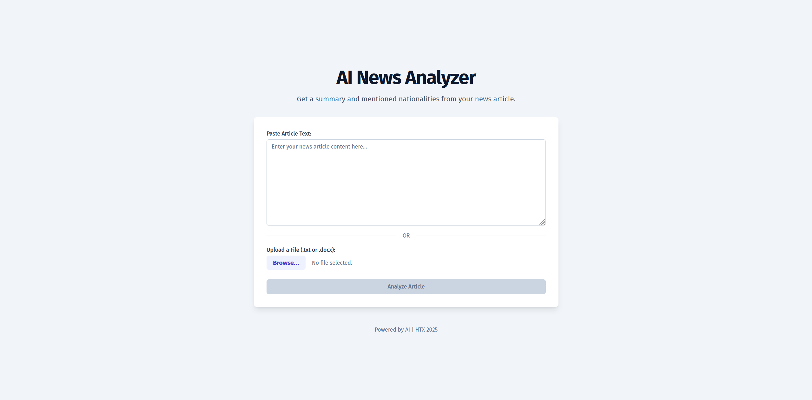

# AI News Analyzer - Frontend

A modern web interface for the AI News Analyzer application that allows users to submit news articles and view AI-generated summaries and entity extraction results.


*Application main interface showing the article submission form and analysis results*

## 🔗 Live URLs

- **Frontend:** [Your Frontend URL when deployed]
  - Example: If deployed to S3: `http://ai-news-analyzer-frontend.s3-website-us-east-1.amazonaws.com`
  - Example: If deployed to Vercel: `https://ai-news-analyzer.vercel.app`
  
- **Backend API:** [Your Elastic Beanstalk URL]
  - Example: `http://ai-news-analyzer-env.exampleURL.us-east-1.elasticbeanstalk.com`

## 🛠️ Technology Stack

- **Framework:** React
- **Build Tool:** Vite
- **State Management:** React Context API
- **UI Components:** [Your UI library, e.g., Material-UI, Chakra UI]
- **Styling:** [Your styling method, e.g., CSS Modules, Tailwind CSS]
- **HTTP Client:** Axios
- **Deployment Options:** AWS S3 Static Website, Vercel

## 🚀 Local Development Setup

### Prerequisites:
- Node.js (v16 or later)
- npm or yarn
- Access to the backend API

### Installation and Setup:

1. **Navigate to the Frontend Directory:**
   ```bash
   cd frontend
   ```

2. **Install Dependencies:**
   ```bash
   npm install
   ```

3. **Configure Environment:**
   Create a `.env` file in the frontend directory:
   ```
   VITE_API_URL=http://localhost:8000
   ```
   Replace with your backend URL as needed.

4. **Start Development Server:**
   ```bash
   npm run dev
   ```

5. **Access the Application:**
   Open your browser and navigate to `http://localhost:5173` (or the port shown in your terminal).

## 📦 Building for Production

### Build for Static Deployment:

1. **Create Production Build:**
   ```bash
   npm run build
   ```
   This creates optimized files in the `dist/` directory.

2. **Preview Production Build Locally (Optional):**
   ```bash
   npm run preview
   ```

## ☁️ Deployment Options

### AWS S3 Static Website Hosting:

1. **Create an S3 Bucket:**
   - Go to AWS Console → S3
   - Create a new bucket (e.g., `ai-news-analyzer-frontend`)
   - Uncheck "Block all public access"
   - Enable "Static website hosting" in bucket properties

2. **Configure Bucket Policy:**
   In bucket permissions, add a bucket policy:
   ```json
   {
     "Version": "2012-10-17",
     "Statement": [
       {
         "Sid": "PublicReadGetObject",
         "Effect": "Allow",
         "Principal": "*",
         "Action": "s3:GetObject",
         "Resource": "arn:aws:s3:::YOUR-BUCKET-NAME/*"
       }
     ]
   }
   ```
   Replace `YOUR-BUCKET-NAME` with your actual bucket name.

3. **Upload Build Files:**
   ```bash
   # Install AWS CLI if not already installed
   pip install awscli
   
   # Configure AWS CLI
   aws configure
   
   # Upload files
   aws s3 sync dist/ s3://YOUR-BUCKET-NAME
   ```
   Or upload manually through the AWS Console.

4. **Access Your Website:**
   - Go to bucket properties → Static website hosting
   - Note the "Bucket website endpoint" URL

### Vercel Deployment:

**Note About Vercel Deployment Issues:**
I initially attempted to deploy the frontend to Vercel with automatic GitHub integration, but encountered challenges:

- Vercel mandates HTTPS for all deployments
- Our backend API currently only supports HTTP
- Due to time constraints, we couldn't configure a custom domain with proper SSL certificates to allow secure communication between the Vercel frontend and our Elastic Beanstalk backend

The Vercel deployment is currently set up with GitHub integration (automatically deploying on commits), but may encounter CORS or mixed content issues when trying to communicate with the backend API.


## 🔒 Environment Configuration

### Production Environment:

When deploying to production, ensure the backend API URL is correctly configured:

1. **For S3 Deployment:**
   - Create a `.env.production` file before building:
   ```
   VITE_API_URL=http://your-backend-url.elasticbeanstalk.com
   ```

2. **For Vercel Deployment:**
   - Configure environment variables in the Vercel dashboard
   - Add `VITE_API_URL` with your backend URL (See initial commit)
