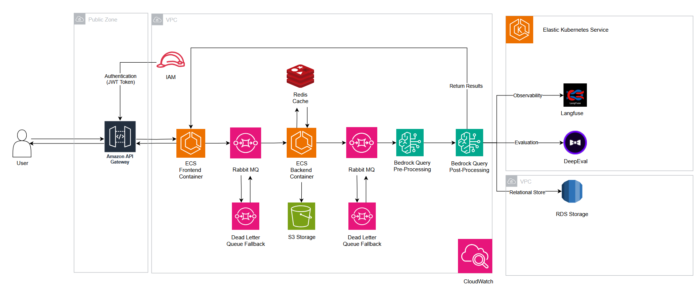

# High-Volume News Processing Architecture

## Overview

This architecture is designed to process a high volume of news articles (targeting 10,000 per hour) by leveraging asynchronous processing, containerization, managed AWS services, and specific observability tools.

## Architecture Components & Flow

### User Interaction & Authentication
- Frontend application hosted in AWS ECS Container (Fargate)
- AWS API Gateway serves as secure entry point on the Public Zone
- Authentication enforced via AWS IAM (validating JWT tokens)

### Frontend Service (ECS)
- Authenticated users interact with UI in ECS Container
- Receives article submissions (text or file format)

### Asynchronous Processing
- Frontend places processing requests on RabbitMQ Queue 1
- Dead Letter Queue (DLQ) configured for reliability

### Backend Processing Service (ECS)
- Pool of Backend ECS Containers consume from RabbitMQ Queue 1
- Auto-scaling based on queue depth or resource utilization
- If cold-start is a concern, we can ensure there a minimum number of containers running without load
- Raw files saved directly to Amazon S3 storage (for data mining/Latent Dirichlet Allocation)
- S3 Lifecycle Policy manages storage costs (Glacial etc)

### Caching & Pre-processing
- Redis Cache checks for previously processed identical articles
- Backend worker prepares and validates article data
- Places messages on RabbitMQ Queue 2 for "Query Pre-processing"
- Queue 2 also has associated DLQ

### AI Model Interaction (AWS Bedrock)
- Dedicated processing consumes messages from Queue 2
- Interacts with AWS Bedrock for AI processing (summary and nationality extraction)
- Creation of sub-queries, query optimization etc can trigger if needed when the context is too complicated
- Results placed on RabbitMQ Queue 3 for "Query Post-processing"
- Queue 3 has associated DLQ

### Post-processing, Observability & Storage
- Final processing consumes from Queue 3
- Parses and formats Bedrock output
- Sends observability data to Langfuse for LLM interaction tracing
- Sends results to DeepEval for continuous evaluation
- Stores final results and metadata in Amazon RDS

### Returning Results to User
- Results returned to user via one of these methods:
  - Polling an API endpoint for job status
  - WebSockets for real-time updates
  - Server-Sent Events (SSE)

## Design Considerations

### Scalability
- ECS Auto Scaling for both Frontend and Backend services
- API Gateway handles large numbers of incoming requests
- RabbitMQ buffers traffic spikes
- AWS Bedrock designed for scalable LLM inference
- S3/RDS/Redis use AWS managed scalable services

### Availability
- Multi-AZ deployment for key components
- API Gateway and S3 with high availability by design
- Dead Letter Queues (DLQs) improve system resilience
- Health checks automatically replace unhealthy instances
- AWS Bedrock provides built-in high availability
- S3 and RDS can have different AZ backups and frequent clonings to prevent downtime

### Cost-Effectiveness
- ECS Fargate eliminates need for EC2 instance management
- Managed AWS services reduce operational overhead (via manpower)
- Redis caching reduces expensive Bedrock API calls
- S3 Lifecycle Policies optimize storage costs (Inactive files shifted to cheaper options)
- Asynchronous processing aligns compute resources with workload
- Utilizing Bedrock allows us to swap models in and out easily without much code changes

## Monitoring and Observability
- Langfuse for LLM interaction tracing and debugging
- DeepEval for continuous evaluation of AI output quality
- AWS CloudWatch for infrastructure metrics and logs

## Conclusion
The above architecture is similar to how my current workplace handles our AI workload. The main idea is to decouple the services while ensuring that each individual service itself is able to scale on it's own without much manual intervention.

In the event of extremely high workload, this architecture ensures simplicty and enabling developers to onboard and get up to speed as soon as possible.